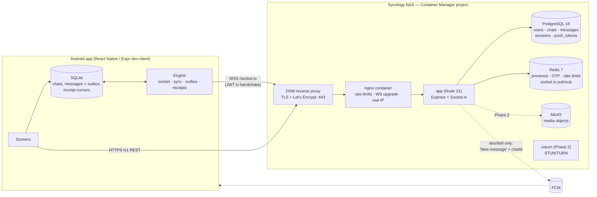

# Pulse Chat — Architecture

Self-hosted, WhatsApp-style messenger. Phase 1 (this repo) ships 1-to-1 text chat with
receipts, presence, offline support and push; Phase 2 items are designed-for but not built.

## 1. System diagram

**Message path (happy case).** `message:send` → app validates + rate-limits → one Postgres
transaction (lock chat row → idempotency check → `seq = last_seq+1` → insert) → ack to sender
with the canonical `seq` → `message:new` fanned out to every participant's `user:<id>` room
(through the Redis adapter, so it works across app instances) → recipient stores it in SQLite,
emits `message:delivered` → cursor update → `receipt:update` back to the sender (✓✓).
If the recipient has no live socket, the server sends the generic FCM doorbell instead.

## 2. Key decisions

| Decision | Choice | Why |
|---|---|---|
| Client runtime | **Expo (dev client + `expo prebuild`)**, not Expo Go, not hand-maintained bare | See §3 |
| Ordering | **Per-chat monotonic `seq`** assigned under a row lock | Total order, gap detection, and a trivial sync cursor (`seq > N`) |
| Receipts | **Cursors** (`last_delivered_seq`, `last_read_seq` per participant) | One tiny UPDATE per batch instead of a row per message × recipient; groups work unchanged (tick = min over members) |
| Idempotency | Client-generated `clientMsgId` UUID, unique per (chat, sender) | Lost ack → client resends → server returns the original row. At-least-once transport, exactly-once effect |
| Local DB | `expo-sqlite`, UI reads only from it | Offline, optimistic send, crash-safe outbox with one code path |
| Presence | Redis sorted set of `socketId → expiry` per user | Self-healing: a crashed instance can't leave users "online" forever (a counter would) |
| Push | FCM as a **doorbell** with a generic payload | Satisfies "no third-party dependency for data": no content, names or numbers leave your server |
| Auth | Phone + OTP → 15 min JWT + rotating opaque refresh token with reuse detection | See §6 |
| Message `status` column | **Not stored**; derived from cursors | A stored per-message status needs a write per receipt and cannot represent multi-recipient groups. `GET /chats` exposes cursors; clients derive ticks |

### Schema deviations from your sketch
* `messages.status` → replaced by `chat_participants.last_delivered_seq / last_read_seq` (above).
* `messages` gained `seq`, `client_msg_id`, `reply_to`, `deleted_at`; `chats` gained `last_seq`, `direct_key`.
* `direct_key = 'minUserId:maxUserId'` (UNIQUE) makes "open a 1-to-1 chat" race-free when both
  users tap at the same time.
* `media(message_id, url, type, size)` → stores an **object key**, never a public URL (signed
  URLs are minted per request in Phase 2).
* `users.status` → `about` (avoids confusion with presence).
* Extra tables: `sessions` (refresh-token families), `push_tokens`, `schema_migrations`.

Full DDL: `backend/src/db/migrations/001_init.sql`.

## 3. Expo vs bare React Native (for *this* project)

| | Expo (managed + prebuild + dev client) | Bare RN |
|---|---|---|
| Native modules (WebRTC, libsignal bindings, SQLite) | ✅ Any native module works via **config plugins + `expo prebuild`**. You lose only **Expo Go**, which you would lose anyway for WebRTC. | ✅ |
| Android project | Generated from `app.config.ts` on every build; `android/` is disposable (git-ignored) | You own and hand-edit `android/`; every RN upgrade is a manual merge |
| CI | The included GitHub Actions workflow: `expo prebuild` → `gradlew assembleRelease` | Same, minus prebuild |
| Upgrades | SDK-aligned versions, `expo install --fix` | DIY compatibility matrix |
| Risk | A native library without a config plugin needs a small custom plugin (~30 lines) | None, but ongoing maintenance |

**Recommendation: Expo with a dev client / prebuild.** You keep full native access for
`react-native-webrtc` (it ships a config plugin) while avoiding permanent ownership of
`android/`. Revisit bare only if you must patch native code that a config plugin cannot express.

Honest caveat for Phase 2 E2E: there is no first-party, maintained React Native binding of
Signal's `libsignal` that I can vouch for. Options are (a) a pure-TypeScript Signal-protocol
implementation, (b) writing a thin native module around `libsignal` (Kotlin/JNI), or (c) a
simpler audited-primitive design (X25519 + XChaCha20-Poly1305 via libsodium, with per-device
keys). Evaluate this **before** group chats — see `BUILD_ORDER.md`.

## 4. Realtime protocol

Transport: Socket.io over WebSocket (`/socket.io`), auth via `auth: { token }` in the handshake.
Every client→server event takes an ack `{ ok: true, ... } | { ok: false, error, retryAfterSec? }`.

| Event | Dir | Payload | Notes |
|---|---|---|---|
| `message:send` | C→S | `{ chatId, clientMsgId, type:'text', content, replyTo? }` | ack `{ message, duplicate }` — `message.seq` is canonical |
| `message:new` | S→C | `Message` | to **all** members incl. sender's other devices |
| `message:delivered` | C→S | `{ chatId, upToSeq }` | monotonic cursor; no-op if not advancing |
| `message:read` | C→S | `{ chatId, upToSeq }` | also advances delivered |
| `receipt:update` | S→C | `{ chatId, userId, deliveredSeq, readSeq }` | cursors of whoever acked |
| `typing` | both | `{ chatId, isTyping }` / `+ userId` | ephemeral, never persisted; receiver auto-expires after 6 s |
| `presence` | S→C | `{ userId, online, lastSeen }` | only on offline↔online transitions, to users who share a chat |
| `sync` | C→S | `{ cursors: { [chatId]: contiguousSeq } }` | ack `{ messages, chats, receipts, hasMore }`; also `POST /v1/sync` |
| `auth:expired` | S→C | — | token about to expire: refresh, reconnect |

REST: see `docs/API.md`.

## 5. The hard problems

### 5.1 Message ordering in an async environment
* **Authority is the database, not arrival order.** `sendMessage` does
  `SELECT … FROM chats WHERE id=$1 FOR UPDATE`, then `seq = last_seq + 1`, inserts, updates
  `last_seq`, commits. The row lock serialises concurrent senders of the *same chat only*
  (different chats stay fully parallel) and is held until COMMIT, so **commit order = seq
  order** and a rolled-back send never burns a seq (no permanent gaps).
* Network delivery may still interleave (two fan-outs racing). Clients therefore **never trust
  arrival order**: they store by `seq`, render by `seq`, and track `synced_seq` = the highest
  seq such that `1..synced_seq` are *all* held. A message with `seq > synced_seq + 1` means a hole
  → trigger `sync` for the missing range.
* Unsent messages (no seq yet) render at the bottom ordered by local creation time, then jump
  into place when the ack arrives. Verified by a 40-way concurrent-sender test
  (`backend/test/integration.test.js`): seqs come back unique, contiguous, strictly ordered.
* Multi-instance: ordering doesn't depend on which app instance handles the send, because the
  lock is in Postgres. Fan-out across instances goes through the Redis adapter.

### 5.2 Reconnection and missed messages
1. Socket.io reconnects with jittered exponential backoff (1 s → 15 s). The `auth` callback runs
   on **every** attempt, so the handshake always carries a fresh token.
2. On `connect`: `sync({cursors})`. The server returns every message with `seq > cursor` for each
   chat (bounded to 500 per pass → `hasMore` → client loops), chats the client has never seen,
   and the receipt cursors of every participant (this repairs stale ticks).
3. Then the client acks `delivered` for what it just received and flushes its **outbox**.
4. The same path runs on app foreground, on network regain (NetInfo), on a sequence gap, and
   after an FCM wake-up. There is exactly one recovery mechanism, so there is one thing to test.
5. Outbox: messages are rows with `state='pending'`, sent strictly in creation order, one at a
   time. Timeout/disconnect → stop and retry in 3 s (order preserved). Server idempotency makes
   the resend safe. Permanent errors (`not_a_member`, `validation_failed`) → `failed`, tap to retry.
6. A server restart disconnects everyone; they all reconnect and sync. Thundering-herd is bounded
   by backoff jitter and by the per-IP connect limiter (30/min).

### 5.3 What one Synology NAS can carry (estimates — measure on your model)
These are engineering estimates, not benchmarks. Your DSM model matters enormously.

| Resource | Rough limit | Notes |
|---|---|---|
| Idle WebSockets | ~5–20 k per Node process | Memory-bound (tens of KB per socket with Socket.io). A 4 GB NAS with Postgres + Redis + DSM leaves maybe 1–1.5 GB for the app → low thousands comfortably |
| Message write rate | Disk-sync bound: roughly **100–300 msg/s** on HDD RAID, **1000+** on SSD/NVMe | Each send is one `fsync`'d transaction on a hot chat row. `synchronous_commit=off` can multiply this at the cost of losing ≤ ~0.6 s of acknowledged messages on power loss |
| CPU | Celeron/Atom-class: JSON + TLS for a few thousand active users is fine; ARM "J"-series NAS is the weak spot | TLS terminates in DSM; Node does no crypto per message in Phase 1 |
| **Upstream bandwidth** | **The first real bottleneck** | Text is negligible (≈ 1 KB/msg). Phase 2 media: 20 Mbps upstream ≈ 2.5 MB/s total ⇒ a handful of concurrent image downloads. Calls via TURN relay: ~1–2 Mbps *each way per call* |
| Power / ISP | Single point of failure | UPS strongly advised; Postgres is crash-safe, clients' outboxes cover short outages |

**Realistic target for this design on a plus-series NAS with HDDs: family/friends/small community
(tens to a couple of thousand registered users, hundreds concurrently online).** Likely order of
bottlenecks: upstream bandwidth (media/calls) → disk fsync latency → RAM → CPU.

Scale-up path without redesign: (1) put Postgres data on SSD volume/cache; (2) run 2–4 `app`
replicas (the Redis adapter, DB-side ordering and Redis-backed rate limits already support it;
sticky sessions are *not* required because the server accepts WebSocket transport only); (3) move media to object
storage elsewhere; (4) PgBouncer if connections grow.

### 5.4 Security
* **Transport**: HTTPS/WSS only (TLS at DSM; HSTS from nginx/helmet). No E2E in Phase 1, as requested —
  the server can read messages; treat the NAS and its backups accordingly.
* **OTP**: 6 digits from `crypto.randomInt`, stored only as an HMAC-SHA256 keyed with a server
  secret (a Redis leak can't be brute-forced offline without the key), 5 min TTL, single use,
  ≤ 5 verify attempts per issued code, plus limiters: request 10/h/IP and 5/h/phone, verify
  30/15 min/IP and 10/15 min/phone (with blocking). Identical response for known/unknown numbers.
  `console` provider is refused when `NODE_ENV=production`.
  *SMS pumping* (attackers triggering paid SMS) is the real cost risk with a paid gateway: keep
  the per-phone and per-IP limits, consider country allow-listing at the gateway.
* **JWT strategy**: access token HS256, 15 min, claims `{sub, sid=familyId}`; refresh token =
  256-bit random, **only its SHA-256 stored**, 60-day sliding. Every refresh **rotates** the
  token. Presenting an already-used token ⇒ assume theft ⇒ the whole family is revoked in
  Postgres *and* flagged in Redis so still-valid access tokens die immediately. The client
  serialises refreshes (single-flight) so a double refresh can never self-trigger this.
  Logout revokes the family. Sockets are cut at token expiry (`auth:expired`).
* **Input**: zod validation on every REST body/query and every socket payload; E.164 phones;
  message text capped at 4096 chars, NFC-normalised, control/zero-width/bidi-override
  characters stripped. Content is stored as *plain text* and never HTML-escaped on write (escape
  on output — React Native `<Text>` doesn't interpret markup, and any future web client must
  escape). All SQL parameterised. Body limit 32 KB (REST) / 64 KB (socket frame).
* **Rate limits**: nginx (`limit_req` / `limit_conn`) → per-IP and per-user Redis limiters
  (`rate-limiter-flexible`, in-memory insurance if Redis is down) → per-event socket limiters
  (30 sends/10 s/user).
* **Authorisation**: every chat operation checks membership server-side; receipt cursors are
  clamped to `chats.last_seq` and monotonic; typing is only relayed to chat members.
* **Hardening**: helmet, `x-powered-by` off, containers run read-only + `cap_drop: ALL` +
  `no-new-privileges`, non-root `node` user, Postgres/Redis never published to the host,
  secrets in `.env` (git-ignored), phone numbers masked in logs, tokens redacted.
* **Known Phase 1 limits** (deliberate, listed so you can decide): no per-user blocklist, no
  account deletion endpoint, contact discovery sends plain E.164 numbers (rate-limited 20/h; hash
  or private-set-intersection is a Phase 2 privacy upgrade), HS256 shared secret (rotate by
  deploying a new secret; sessions survive because refresh tokens are server-side).

### 5.5 Exposing the Synology safely
**First: check you can accept inbound connections at all.** If your router's WAN IP differs from
what a "what is my IP" site shows (or is in `100.64.0.0/10`), you are behind **CGNAT** and port
forwarding is impossible. Common on mobile/DSL ISPs. Fixes, in order of preference for control:
ask the ISP for a public IP; run a small VPS as a public front-end that reverse-proxies to the
NAS over WireGuard; Tailscale/ZeroTier (clients must join the network); Cloudflare Tunnel (works
behind CGNAT but puts a third party in the path, which conflicts with your "no third parties" goal).

Recommended topology (see `docs/SYNOLOGY.md` for click-by-click):
1. DDNS name (Synology DDNS or your own domain) → your public IP.
2. Router: forward **only TCP 443** → NAS. Nothing else (not 5000/5001, not 22, not 5432/6379).
3. DSM **Reverse Proxy**: `https://chat.example.com:443` → `http://127.0.0.1:8080` (the nginx
   container, bound to loopback). WebSocket works with the "Custom Header → WebSocket" preset.
   Certificate: DSM *Security → Certificate* → Let's Encrypt (auto-renew); assign it to that rule.
4. DSM Firewall: allow 443 from anywhere (or a country allow-list), deny the rest from WAN;
   allow DSM admin ports from LAN only. Enable **Auto Block**, **2-step verification** for every
   admin, disable the default `admin` and `guest` accounts, DSM auto-updates on.
5. Docker network is internal; only `127.0.0.1:8080` is published. Put the NAS on a VLAN/DMZ if your
   router supports it so a compromise can't pivot to the LAN.
6. Backups: Hyper Backup of the project folder + a nightly `pg_dump` (cron/Task Scheduler) to a
   *different* volume or off-site; test a restore once.
7. Watch: `docker logs`, DSM Log Center, and failed-login notifications.

## 6. Phase 2 hooks already in place
* `media` table, `messages.type` enum, `reply_to`, `chat_participants.role` (`owner/admin/member`),
  receipt cursors that already generalise to N members, membership cache + `user:<id>` fan-out
  that already iterates participants, and `compose` overlay slots for MinIO + coturn.
* WebRTC signalling will ride the existing socket (`call:offer/answer/ice`); TURN credentials are
  short-lived HMAC credentials minted by the backend (`use-auth-secret` in coturn).
